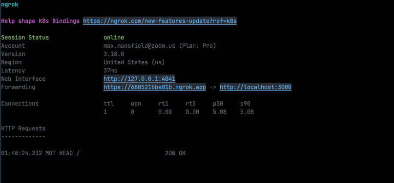
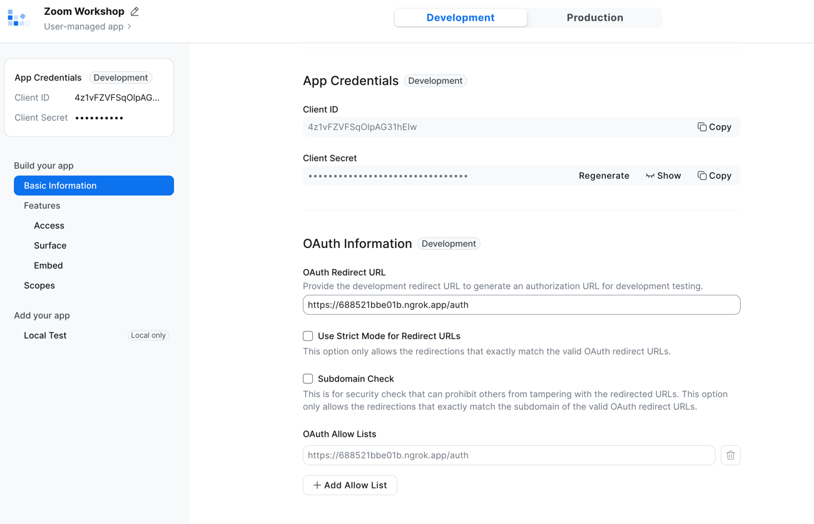
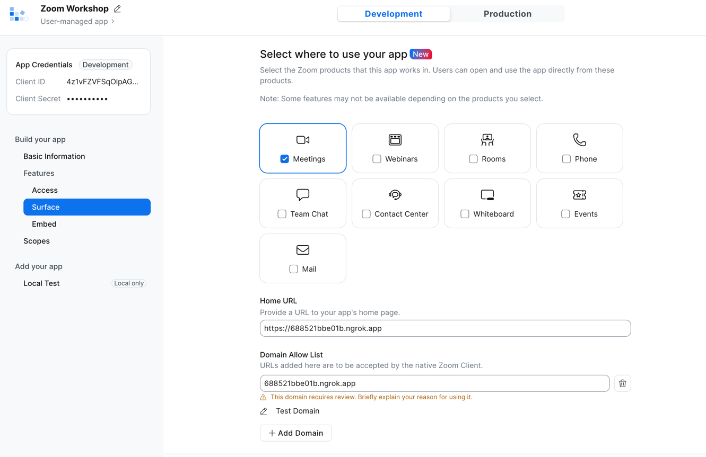

# Getting Started with Zoom Apps

This is a [Next.js](https://nextjs.org) project bootstrapped with [
`create-next-app`](https://github.com/vercel/next.js/tree/canary/packages/create-next-app). 

I've modified it a bit so
that we can create a powerful Zoom App development environment. 

Follow along with these branches to implement it yourself
or check out the completed project on the main branch (here).

## Prerequisites

You'll need the following for this workshop:

1. [Node JS](https://nodejs.org/en/)
2. [Ngrok](https://ngrok.com/docs/getting-started)
3. [Zoom Account](https://support.zoom.us/hc/en-us/articles/207278726-Plan-Types-)
4. [Zoom App Credentials](#config:-app-credentials) (Instructions below)
   1. Client ID
   2. Client Secret
   3. Redirect URL

## Before you start

Make sure that you have created an app on the Zoom Marketplace. 

> Check out our guide [here](https://developers.zoom.us/docs/build-flow/)

## Getting Started

Install dependencies

```bash
npm install
```

Start Ngrok and copy your URL

```bash
ngrok http 3000
```



In your browser, navigate to your app in the [Zoom Marketplace](https://marketplace.zoom.us/user/build). 

In the Basic Information tab add the `/auth` route to your Ngrok URL for the OAuth Redirect URL




Next, select the **Surface** tab and enter the Ngrok URL as your Home URL




Enter your credentials in .env.local

```dotenv
# Do not store credentials in plain text on production environments

ZOOM_CLIENT_ID=
ZOOM_CLIENT_SECRET=
ZOOM_REDIRECT_URL=

# Generated after you run npm install
SESSION_SECRET=random_string_generated_for_you
```

Run the development server:

```bash
npm run dev
```

Navigate to your Ngrok URL to see your new app!
